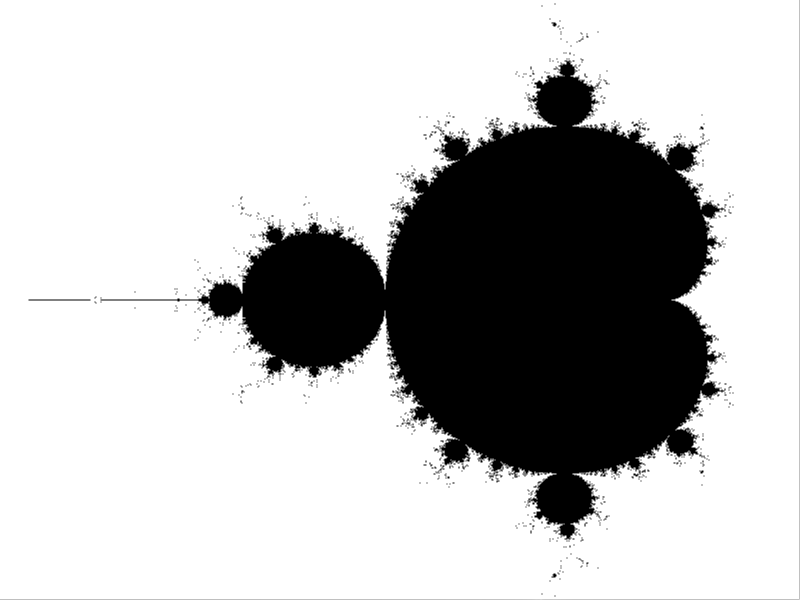
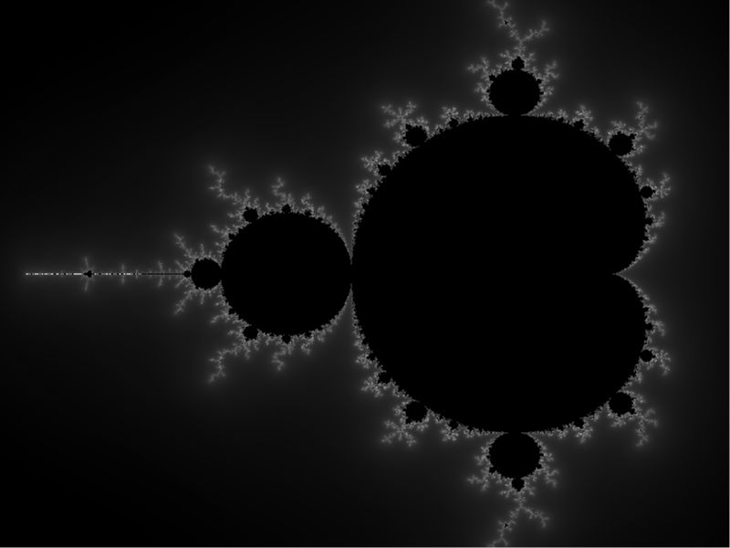
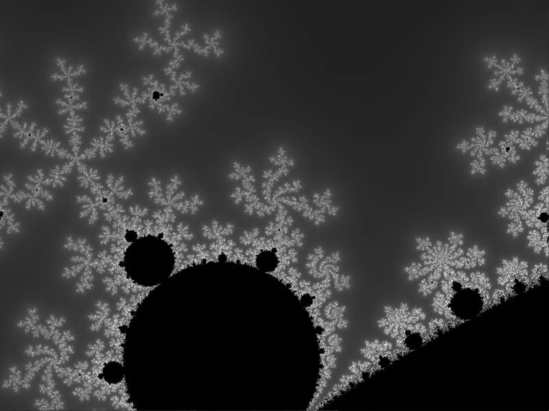

# Sample Scala project with Processing

You will need to download [Processing](http://processing.org) and add `core.jar` to the `lib` folder.

You will also need to have the native library bindings available in your system.

See [this blog post](http://www.mostlymaths.net/2018/03/processing-and-scala.html) for some pointers.

---

If you have problems with the OpenGL bindings or drivers (problems with `jogl` on import / compile / run) try to change the call to `size` by removing
`PConstants.P3D` (so, just 2 size parameters) `main.scala`. This will use a
native Java writer instead of one of the OpenGL bindings (`PConstants.P3D` or
`PConstants.P2D`). This will let you check if you have an OpenGL issue. Beware, the default renderer left ghost trails on zoom. Use only for debugging.

---

**Note:** this is a toy project to get Processing up and running. The quality of the images generated is poor. In a more complete implementation, aside from speed up tricks (attraction basin checks, for instance) I would add antialiasing. It is not that hard to add, but here I wanted to have a shot at making it work and be slightly interactive.

Also, Processing works the way it works, so I need `var`s, at least for now. It saddens me more than you...

---

# Running

```
sbt run
```

Press `q` to quit. 

Press `g` to switch from continuous grayscale potential and pure black and white based on distance (delta is automated)

Click to zoom where you click (zoom factor, iteration limit and distance
estimate are roughly automated)

Current image is automatically saved as `image.png` in the root folder. 


# Some sample images




